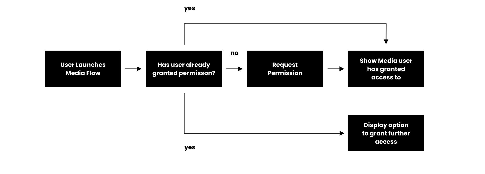

# Nacitavanie suborov
### Disclaimer
Tieto priklady maju pomoct implementovat zakladny "happy path" pre ukladanie suborov do privatneho ale aj do externeho uloziska. Vzdy je dolezite si uvedomit, ze v praci je potrebny error handling a dokladnejsi edge case handling. Tieto priklady su len na ukazku a nie na pouzitie v produkcnom kode.

## Privatne ulozisko
Pri privatnom ulozisku je potrebne poznat cestu k suboru. Ak cestu nepozname, stale je mozne dany subor zaujmu najist aj pomocou dokumentacie v [folder](folder/README.md).
Pri privatnom ulozisku nemusime pracovat so ziadnym specialnym frameworkom ani opravneni. Ak by som chcel pracovat s nacitanim privatnym suborom externe mimo aplikacie,
je potrebne pouzit `FileProvider`.

### FileProvider
`FileProvider` je framework, ktory umoznuje zdielat subory s inymi aplikaciami. Tento framework je potrebne nastavit v `AndroidManifest.xml` a vytvorit `res/xml/provider_paths.xml`.
V skratke co `FileProvider` zmeni uri `file://` na `content://`. Tymto sposobom sa zabezpeci, ze subor je zdielatelny s inymi aplikaciami. Zaroven tymto sposobom
vieme menezovat aj prava k tomuto suboru. Ak by sme chceli menit prava k suboru za pomoci file uri `file://`, museli by sme menit na urovni systemu. Tymto ten subor je otvoreny
aj pre ine externe aplikacie nie len pre tu, ktorej chceme subor zdielat.

**provider_paths.xml**
V tomto xml subore definujeme cesty k priecinkom, ktore `FileProvider` moze zdielat. Zaroven to zabezpecuje aj istu anonimitu pre subory o ich lokacii. 
Priklad: 
`/0/storage/data/com.parohy.scopedstorage/files/obrazky/obrazok.jpg`
Ak to chcem zdielat cez `FileProvider`, potrebujeme mu zadefinovat pristupy:
`<files-path name="obrazocky" path="/obrazky" />`
- `files-path` nam poukazuje na `filesDir`
- `name` je alias, pod ktorym sa bude dana cesta skryvat
- `path` je relativna cesta k priecinku, ktory chceme zdielat
  - mozme pouzit aj `.` cim davame pristup k celemu `filesDir`

Ak si vypiseme taketo `Uri` do konzoly, dostaneme nieco take:
`content://com.parohy.scopedstorage.fileprovider/obrazocky/obrazok.jpg`


## Verejne ulozisko
Pri verejnom ulozisku Google postupne utahoval opasok ohladne bezpecnosti. Kazdou novsou verziou Androidu pocnuc Android 10 sa zmenili prava k verejnemu ulozisku.

### Nacitavanie
Pre vsetky verzie Androidu je mozne nacitat subor a pracovat s nim aj bez ziadania prav na citanie. Toto plati len v pripade, ze pouzijete SAF (Storage Access Framework).
SAF, ako aj v [SAF docs](https://developer.android.com/guide/topics/providers/document-provider), pise uz obsahuje v sebe nadstsavku ba ScopedStorage. Cize ak pouzijete Intent na vybrenie suboru pomocou `Intent.ACTION_OPEN_DOCUMENT`, tak sa to povazuje, ze user manualne suhlasil so zdielanim konrektneho subora.

Subory je mozne nacitat aj pomocou `ContentResolver` ([docs](https://developer.android.com/guide/topics/providers/content-provider-basics#ClientProvider)). Tu uz je potrebne si pytat prava na citanie. Jednotlive pravomoci a metody sa odlisuju podla verzie Androidu.
Tak isto je dolezite pracovat s `MediaStore` ([co to je](#MediaStore)). `ContentResolver` pomocou query nacita pozadovane subory z verejneho uloziska.

### MediaStore
[docs](https://developer.android.com/training/data-storage/shared/media)
Ulozisko Androidu si predstavte ako SQL databazu. Kazdy subor je zaznam v tabulke. Tato tabulka obsahuje rozne stlpce, ktore reprezentuju informacie o subore. Napriklad `MediaStore.Images.Media.DISPLAY_NAME` reprezentuje meno suboru.
Kazda verzia Androidu ma definovane nazvy tychto stlpcov inac, preto je potrebne pouzivat tieto konstanty. Tieto konstanty su odlisne aj podla `mimeType` alebo skor o aky typ media mam zaujem. Zaroven, `MediaStore` uz obsahuje nadstavbu ScopedStorage,
cize ak pouzijem `MediaStore`, uz sa riadim podla opravnenych postupov Androidu.
**Prava na citanie si ziadat vobec nemusim, ak chcem pristupovat len k suborom, ktore vlastnim. V preklade to znamena: sobory, ktore som vytvoril v tejto aplikacii.**

### Android 9 a nizsie
Ak pouzijem `ContentResolver`, je potrebne si poziadat o `READ_EXTERNAL_STORAGE`.

### Android 10-12
Ak pouzijem `ContentResolver`, je potrebne si poziadat o `READ_EXTERNAL_STORAGE`.


### Android 13 a vyssie
Ak pouzijem `ContentResolver`, jre potrebne si ziadat `READ_MEDIA_IMAGES`, `READ_MEDIA_VIDEO` alebo `READ_MEDIA_AUDIO`.
Tu uz si vyberiete, aky obsah chcete nacitat:
* Ak chcete nacitat obrazky, pouzijete `READ_MEDIA_IMAGES`
* Ak chcete nacitat videa, pouzijete `READ_MEDIA_VIDEO`
* Ak chcete nacitat audio, pouzijete `READ_MEDIA_AUDIO`

Ak sucasne viac druhou medii, tak kombinacia ich, cize `requestMultiplePermissions`. Tento permission je specialny tym, ze user moze konrektne zvolit iba jednotlive konkretne polozky, ktore chce povolit. 
V takomto pripade sa udeluje permission `READ_MEDIA_VISUAL_USER_SELECTED` co reprezentuje ciastocne permission. Ak je tato permission platna, treba udelit moznost uzivatelovu pridat dalsie media. Napriklad
tlacidlo, ktore poziada o permission. Samozrejme obrazovka alebo funkcionalita, by nemala byt blokovana, cize na pozadi by user mal vediet pracovat uz so subormi, ktore uz manualne povolil.


**V praxi takyto permission moze vyzerat nasledovne:**
```kotlin
    // requestMultiplePermissions je custom funkcia, ktora spusta ActivityResultContracts.RequestMultiplePermissions a v pripade PERMISSION_GRANTED spusti lambdu
    // Pre Android 13+ je potrebne READ_MEDIA_IMAGES a READ_MEDIA_VIDEO ak chcem nacitat obrazky aj videa, ktore som nevytvoril z tejto aplikacie
    if (Build.VERSION.SDK_INT >= Build.VERSION_CODES.TIRAMISU)
      if (checkSelfPermission(android.Manifest.permission.READ_MEDIA_IMAGES) == android.content.pm.PackageManager.PERMISSION_GRANTED || checkSelfPermission(android.Manifest.permission.READ_MEDIA_VIDEO) == android.content.pm.PackageManager.PERMISSION_GRANTED) {
        /*User udelil uplny pristup ku fotkam a videam. Staci, ak povoli len jedno z nich "Allow all" a ma automaticky full pristup aj k druhemu. Preto je v podmienke OR*/
        ...rob daco s obrazkami a videami...
      } else if (checkSelfPermission(android.Manifest.permission.READ_MEDIA_VISUAL_USER_SELECTED) == android.content.pm.PackageManager.PERMISSION_GRANTED) {
        /*User udelil ciastocny pristup, to znamena, ze manualne volil media, ktore dovoluje zdielat s aplikaciou. Malo by to byt non-blocking,
        * cize odoslem vysledok ale popytam si opat pristup. Dodatocne pytanie si pristupu by malo byt UI/UX oddelene od hlavnej akcie, napriklad extra tlacidlo,
        * ktore by vyvolal systemovy permission na READ_MEDIA_IMAGES a READ_MEDIA_VIDEO*/
        ...rob daco s obrazkami a videami...
        /*!!POZOR!! -> Tento call by mal byt volany dodatocne cez ine tlacidlo akciu, nie hlavnu. Ale toto je len example, ale takto to nekopiruj!*/
        requestMultiplePermissions(android.Manifest.permission.READ_MEDIA_IMAGES, android.Manifest.permission.READ_MEDIA_VIDEO) {
          ...rob daco s obrazkami a videami...
        }
      }
      else // Ak este nemam pristup, tak si ho poprosim
        requestMultiplePermissions(android.Manifest.permission.READ_MEDIA_IMAGES, android.Manifest.permission.READ_MEDIA_VIDEO) {
          ...rob daco s obrazkami a videami...
        }
    // Pre Android 12 a nizsie staci READ_EXTERNAL_STORAGE
    else
      if (checkSelfPermission(android.Manifest.permission.READ_EXTERNAL_STORAGE) == android.content.pm.PackageManager.PERMISSION_GRANTED)
        ...rob daco s obrazkami a videami...
      else
        requestPermission(android.Manifest.permission.READ_EXTERNAL_STORAGE) {
          ...rob daco s obrazkami a videami...
        }
```

**Image picker**
_TODO - popisem ked to preskumam. Podla mojich vedomosti, malo by to riesit permissions za nas_

# Rozdelenie podla typu mimeType

### Audio sobory
<sub>**Poznamka:** TODO</sub>
Dokumentacia je dostupna v [audio](audio/README.md)

### Dokumenty
Dokumentacia je dostupna v [document](document/README.md)

### Obrazky
Dokumentacia je dostupna v [picture](picture/README.md)

### Video
Dokumentacia je dostupna v [video](video/README.md)

### File
Dokumentacia je dostupna v [file](file/README.md)

### Priecinok
Dokumentacia je dostupna v [folder](folder/README.md)

### Galeria
Dokumentacia je dostupna v [gallery](gallery/README.md)
